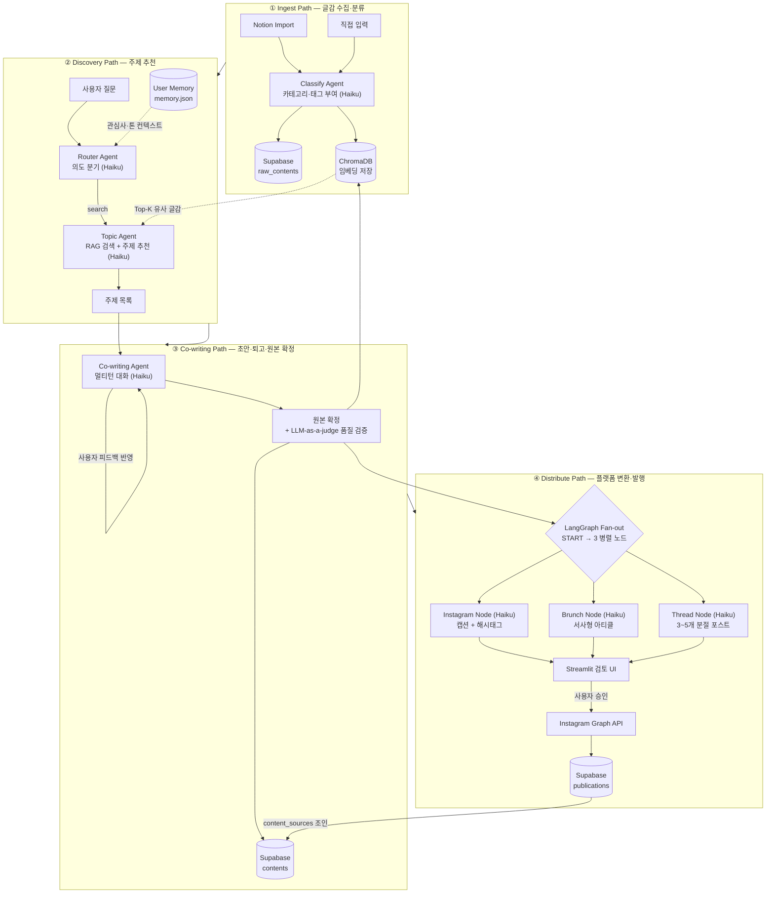

# Inkflow — Content Management Service

> MVP (2026.04.26 ~ 진행 중)
> 글감 하나를 수집·분류하고, RAG로 주제를 추천받아 초안을 함께 작성한 뒤,  
> LangGraph Multi-Agent로 인스타그램·브런치·스레드에 맞는 형태로 자동 변환·발행하는 콘텐츠 매니지먼트 시스템.

**[UI 데모](https://inkflow-liard.vercel.app/)** | **[API 문서](https://inkflow-api.fly.dev/docs)** | **[개발 과정 (Notion)](https://syk25.notion.site/Inkflow-AI-35713427265881b3875bdc0b93add7df?source=copy_link)**

---

## 시스템 아키텍처



### 설계 포인트

| 결정                           | 이유                                                                      |
| ------------------------------ | ------------------------------------------------------------------------- |
| Supabase + ChromaDB 이중 저장  | CRUD·트랜잭션 → 관계형, 유사도 검색 → 벡터 DB. 각자 강점에 집중           |
| LangGraph Fan-out (Distribute) | instagram·brunch·thread 3 노드를 동시 실행 → 단일 순차 대비 지연 ~3× 단축 |
| Claude Haiku 전면 채택         | 복잡도 대비 품질이 MVP 수준 충족, 비용 Sonnet 대비 ~4× 절약 (ADR-003)     |
| User Memory (JSON 파일)        | 질문 패턴·관심사·선호 톤을 Router Agent 컨텍스트로 주입해 추천 개인화     |
| content_sources 조인 테이블    | 글감 → 원본 → 발행물 추적 가능. 하나의 원본이 여러 글감 참조 허용         |

---

## 기술 스택

| 레이어               | 기술                                      |
| -------------------- | ----------------------------------------- |
| 언어·런타임          | Python 3.11, uv                           |
| API 서버             | FastAPI                                   |
| LLM                  | Anthropic Claude Haiku 4.5                |
| Agent 오케스트레이션 | LangGraph                                 |
| 임베딩               | Voyage AI (voyage-3)                      |
| 벡터 DB              | ChromaDB (persistent, Fly.io 볼륨 마운트) |
| 관계형 DB            | Supabase (PostgreSQL)                     |
| UI                   | Streamlit                                 |
| 외부 API             | Notion SDK, Instagram Graph API           |
| 인프라               | Docker + Fly.io (도쿄 nrt 리전)           |
| 테스트               | pytest + LLM-as-a-judge                   |

---

## API 엔드포인트

### Ingest

| Method | Path               | 설명                                    |
| ------ | ------------------ | --------------------------------------- |
| `POST` | `/ingest/notion`   | Notion DB 증분 import + 분류 Agent 실행 |
| `GET`  | `/ingest/contents` | 저장된 글감 목록 조회                   |

### Discovery

| Method | Path               | 설명                                   |
| ------ | ------------------ | -------------------------------------- |
| `POST` | `/discovery/route` | 사용자 질문 → Router Agent → 주제 추천 |

### Co-writing

| Method | Path                | 설명                                |
| ------ | ------------------- | ----------------------------------- |
| `POST` | `/cowrite/draft`    | 초안 생성 (멀티턴 히스토리 첫 호출) |
| `POST` | `/cowrite/revise`   | 퇴고 (히스토리 누적 전달)           |
| `POST` | `/cowrite/finalize` | 원본 확정 + DB 저장 + 임베딩        |
| `POST` | `/cowrite/judge`    | LLM-as-a-judge 품질 평가            |

### Distribute

| Method | Path                            | 설명                                                  |
| ------ | ------------------------------- | ----------------------------------------------------- |
| `POST` | `/distribute/convert`           | LangGraph Fan-out → instagram·brunch·thread 동시 변환 |
| `POST` | `/distribute/publish/instagram` | Instagram Graph API 발행 + publications 저장          |

---

## 로컬 개발

### Docker Compose (권장)

```bash
# backend/.env 설정 후
docker compose up --build
# → API: http://localhost:8000/docs
# → UI:  http://localhost:3000
```

### 개별 실행

```bash
# 백엔드
cd backend
uv sync
cp .env.example .env   # API 키 입력
uv run uvicorn app.main:app --reload
# → http://localhost:8000/docs

# 프론트엔드 (별도 터미널)
cd frontend
npm install
npm run dev
# → http://localhost:3000
```

자세한 내용은 각 디렉토리의 README를 참고하세요:

- [backend/README.md](backend/README.md)
- [frontend/README.md](frontend/README.md)

---

## 클라우드 배포

```bash
# 백엔드 (Fly.io)
cd backend && fly deploy --config fly.toml
# → https://inkflow-api.fly.dev

# 프론트엔드 (Vercel 등 Next.js 호스팅)
cd frontend && npm run build
```

- API: `https://inkflow-api.fly.dev`
- ChromaDB: Fly.io 퍼시스턴트 볼륨 (`inkflow_chroma_data`, 1 GB) 마운트
- 리전: 도쿄 (`nrt`)

---

## 아키텍처 결정 기록 (ADR)

설계·기술 선택의 근거는 [`docs/adr/`](docs/adr/)에 정리되어 있습니다.

| ADR                                            | 결정 사항                                     |
| ---------------------------------------------- | --------------------------------------------- |
| [ADR-001](docs/adr/001-supabase-chromadb.md)   | Supabase + ChromaDB 이중 저장 구조            |
| [ADR-002](docs/adr/002-langgraph.md)           | LangGraph Multi-Agent 선택                    |
| [ADR-003](docs/adr/003-claude-haiku-sonnet.md) | Claude Haiku 전면 채택 (Sonnet vs Haiku 비교) |
| [ADR-004](docs/adr/004-fastapi.md)             | FastAPI 선택                                  |
| [ADR-005](docs/adr/005-uv.md)                  | uv 선택                                       |

---

## MVP 범위 외 (의도적 제외)

- 모니터링·SLA·온콜 — 프로덕션 운영 범위
- 사용자 인증 (Auth) — Supabase Auth 통합 미완, MVP 비범위로 ADR 박제
- Notion import 병렬화 — 현재 93개 순차 처리 ~3분 45초, `concurrent.futures` 적용 시 ~20초로 단축 가능 (MVP 이후)
- pgvector 통합 — ChromaDB → Supabase pgvector 마이그레이션 가능하나 14일 내 우선순위 아님
